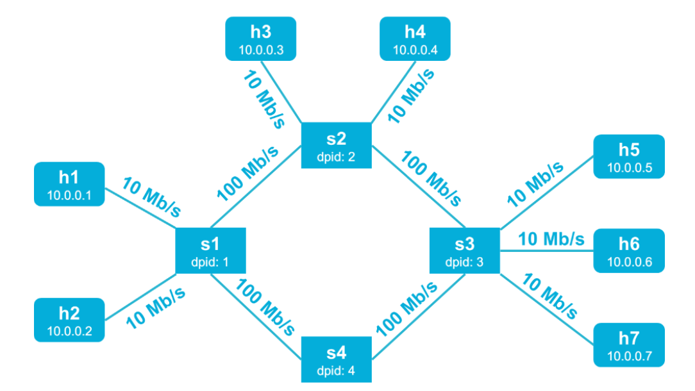

# Mininet-Virtual-Network
The programming assignment for CS4226 Internet Architecture.

*AY 2019-2020 / Semester 1 by Richard Ma*

## Task 1: Building a Virtual Network



To build the network with topology and specifications in the **[topology.in](topology.in)**, I overrided the `build` method of `Topology` class. 

#### Implementation:

```python
def build(self, input_file='topology.in'):
		f = open(input_file)
    #...
    for n in range(N):
	      self.addHost('h%d' % (n+1))
    for m in range(M):
        sconfig = {'dpid': "%016x" % (m+1)}
        self.addSwitch('s%d' % (m+1), **sconfig)
    for l in lines:
        d1, d2, bandwidth = l.strip().split(',')
        self.addLink(d1, d2)
        # self.addLink(d1, d2, bw=bandwidth) would raise a TypeError: __init__() got an unexpected keyword argument 'bw'

```

####Result:


## Task 2: Learning Switch

In this task, I created a `flow_table ` python dictionary attribute in `Controller(EventMixin)` and created a `Entry ` class for the `flow_table`.

```python
# Entry(object)
def __init__(self, port, mac):
		self.timeout = time.time() + FLOW_TIMEOUT
		self.port = port
		self.mac = mac
# Controller(EventMixin)
def __init__(self):
  	# dpid -> {mac->entry}
    self.flow_table = dict()
    # handles entry expiring
    self._expire_timer = Timer(5, self._handle_expiration, recurring=True)
```

#### Result:


## Task 3: Virtual Local Area Networks (LANs)

As shown in **[policy.in](policy.in)**:  *h1 (10.0.0.1), h2 (10.0.0.2), h3 (10.0.0.3), h4 (10.0.0.4)* belong to **LAN 1**, and *h5 (10.0.0.5), h6 (10.0.0.6), h7 (10.0.0.7)* belong to **LAN 2**.  

#### Implementation:

```python
# Send the firewall policies to the switch
def sendFirewallPolicy(connection, policy):
    block = of.ofp_match()
    block.dl_src = EthAddr(self.ip2mac(policy[0]))
    block.dl_dst = EthAddr(self.ip2mac(policy[1]))
    block.dl_type = 0x0800 # IP
    block.nw_proto = TCP_PROTOCOL
    block.tp_src = 4001 # block packet from 4001 port
    flow_mod = of.ofp_flow_mod()
    flow_mod.match = block
    connection.send(flow_mod)
for p in self.policys:
    sendFirewallPolicy(event.connection, p)
```

#### Result:

1. ***h1 <-> h2***

   

2. ***h1<->h5*** (no response)

   

## Task 4: Premium Service Class

#### Implementation:

```python
# Check the packet and decide how to route the packet
def forward(outport, message = None, is_premium=False):
    message.data = event.ofp
    if is_premium:
        message.actions.append(of.ofp_action_enqueue(port = outport, queue_id=1))
    else:
        message.actions.append(of.ofp_action_output(port = outport))
    event.connection.send(msg)

# When it knows nothing about the destination, flood but don't install the rule
def flood (message = None, is_premium=False):
    message.data = event.ofp
    if is_premium:
        message.actions.append(of.ofp_action_enqueue(port = of.OFPP_FLOOD, queue_id=1))
    else:
        message.actions.append(of.ofp_action_output(port = of.OFPP_FLOOD))
    event.connection.send(msg)

msg = of.ofp_packet_out()
is_premium = False
if isinstance(p, ipv4):
    if DEBUG:
        log.info("%s->%s, %s",p.srcip,p.dstip,p.protocol)
        log.info("%s->%s",packet.src,packet.dst)
    is_premium = p.srcip in self.premium or p.dstip in self.premium

```

